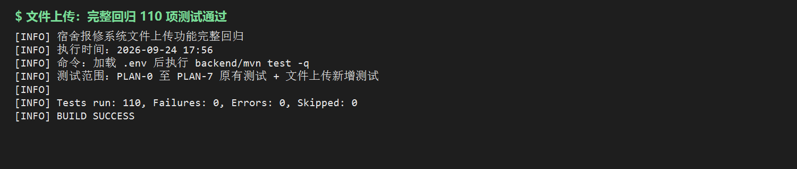
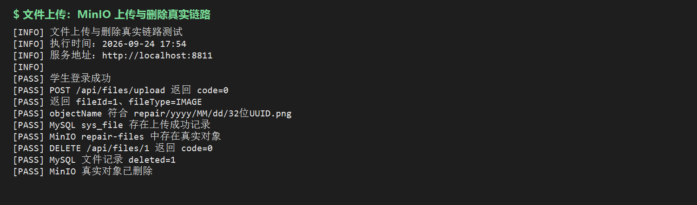
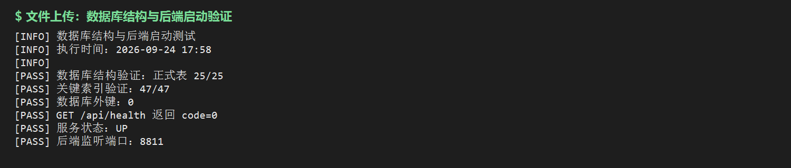

# 文件上传功能验收记录

## 1. 验收信息

- 验收日期：2026-09-24
- 需求依据：`doc/requirements/文件上传.md`
- 实施范围：仅后端公共文件服务、MinIO 接入、业务附件绑定、详情聚合、数据库结构与接口文档；前端代码不在本阶段范围内。
- 后端地址：`http://localhost:8811`
- MinIO Bucket：`repair-files`（私有桶）

## 2. 实现结果

1. 新增 `sys_file`、`repair_order_file`、`repair_process_file`、`repair_rework_file`，数据库现有正式表共 25 张。
2. 新增公共上传和未绑定文件删除接口，Spring Boot 统一接收二进制并上传 MinIO。
3. 图片支持 JPG/JPEG/PNG/WebP，限制 10MB；视频支持 MP4/MOV/WebM，限制 200MB；后缀与 MIME 双重校验。
4. 学生仅可上传 `REPAIR`、`REWORK`，维修人员仅可上传 `PROCESS`，身份取自 JWT 登录上下文。
5. 报修、维修过程、维修结果、返工接口改为接收 `fileIds`；文件与业务记录在同一本地事务中绑定。
6. 绑定时校验上传人、业务类型、文件状态、删除状态及全局未绑定状态；重复 ID 去重后按首次出现顺序保存，最多 9 个。
7. 工单详情在 `baseInfo.files`、`processRecords[].files`、`reworkRecords[].files` 中返回动态 MinIO 临时签名地址。
8. 未绑定文件支持上传人主动删除，并由 24 小时孤儿文件定时任务兜底；批处理中每条文件使用独立事务，单条失败不影响其他候选项。
9. MinIO 上传成功但数据库或预览处理失败时执行对象删除补偿；Bucket 可按配置在开发环境启动时自动创建。

## 3. 自动化测试

加载本机 `.env` 后执行：

```powershell
cd backend
mvn test -q
```

结果：`Tests run: 110, Failures: 0, Errors: 0, Skipped: 0`。

覆盖内容包括原 PLAN-0 至 PLAN-7 回归、文件类型与角色限制、文件 ID 去重、他人文件拒绝绑定、维修过程/结果附件绑定、返工附件绑定、详情权限及聚合响应。



## 4. 真实 MinIO 链路

使用学生测试账号和 PNG 文件执行：

1. `POST /api/files/upload?bizType=REPAIR` 上传成功，返回 `fileId=1`、`fileType=IMAGE`。
2. `objectName` 符合 `repair/yyyy/MM/dd/32位UUID.png`，未使用原始文件名作为对象键。
3. MySQL `sys_file` 存在 `status=1、deleted=0` 的元数据。
4. MinIO 私有桶 `repair-files` 中存在对应真实对象。
5. `DELETE /api/files/1` 成功后，MySQL 更新为 `deleted=1`，MinIO 对象已删除。



## 5. 数据库与启动验证

执行 `scripts/verify-database-schema.ps1`：正式表 `25/25`、关键索引 `47/47`、外键 `0`。最新版后端已重新启动，`GET /api/health` 返回 `code=0`、状态 `UP`，监听端口为 `8811`。



## 6. 手动验收建议

1. 分别使用学生和维修人员账号上传符合用途的图片、视频，确认返回 `fileId` 和可访问的临时 `previewUrl`。
2. 用学生账号伪造 `PROCESS`、维修人员伪造 `REPAIR`，应返回 HTTP 403。
3. 上传非法后缀、后缀与 MIME 不匹配、超限文件，确认返回对应 18xxx 业务码。
4. 通过报修、维修过程、维修结果、返工接口提交 `fileIds`，查询详情确认文件出现在对应层级。
5. 使用其他账号绑定文件或重复绑定已使用文件，分别确认 HTTP 403 与 HTTP 409。
6. 删除未绑定文件应成功；删除已绑定文件应返回 HTTP 409。

## 7. 未实施范围

- 前端公共上传组件、进度条、预览和页面接入仅在接口文档中提出要求，本阶段未修改前端代码。
- 分片上传、断点续传、秒传、转码、压缩、内容审核及前端直传 MinIO 不在本阶段范围内。
